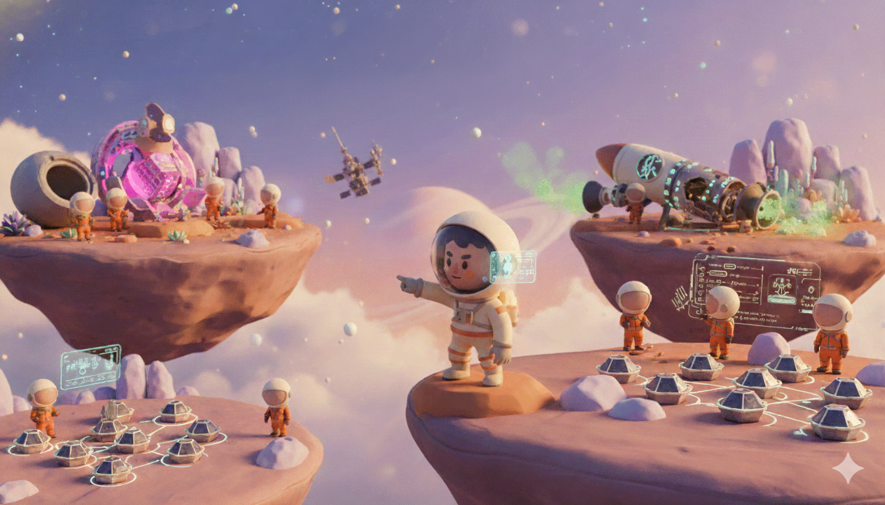

# 🚀 Project Rescue Mission

**Status**: *CRITICAL*
**Objective**: Recover 15 stranded civilians from Sector 7.
**Threat Level**: High (Interstellar Interference, Damaged Infrastructure)

---

## 📜 The Mission Brief

A catastrophic solar flare has crippled the communication array of the **Orion VII** colony. 15 civilians are stranded in the outer rim, their life support failing. 

Traditional rescue methods are impossible due to the magnetic interference. We have activated the **Autonomous Rescue Protocol**, comprising three specialized agentic missions initiated to save them.



### 🛑 1. [Mission Alpha: Live API](mission-alpha-drone/)
**"The Neural Link"**
*   **Objective**: Authorize and launch the Autonomous Drone.
*   **Challenge**: The central security firewall is locked down. Manual override requires a **Biometric Neural Sync**.
*   **Tech Stack**: **Google ADK for Live API**, React, WebSockets, **Google Gemini(Multimodal Agent)**.
*   **Key Mechanic**: A multimodal AI agent visually scans your hand gestures (1-5 fingers) to perform a "Neural Handshake" and unlock the system.

### 🛠️ 2. [Mission Bravo: Live API & Multi-agent system](mission-bravo-engineer/)
**"The Swarm Intelligence"**
*   **Objective**: Repair the infrastructure and coordinate the logic.
*   **Challenge**: The backend systems are fragmented. We need an intelligent agent to write code, fix bugs, and optimize the drone paths.
*   **Tech Stack**: **Google ADK for Live API**, **Agent2Agent Protocol**, Python, WebSockets,**Google Gemini(Multimodal Screen & Audio)**, Agent as Tool .
*   **Key Mechanic**: An autonomous coding agent that can read the repository, plan changes, and execute fixes to the mission codebase.

### 📡 3. [Mission Charlie: Event Driven Architecture](mission-charlie-eda/)
**"The Event Horizon"**
*   **Objective**: Establish a resilient Event-Driven communication mesh.
*   **Challenge**: Requests are dropping. We need a non-blocking, event-driven architecture to coordinate the fleet in real-time.
*   **Tech Stack**: **Google ADK**, **Agent2Agent Protocol**, **Apache Kafka**, Server-Sent Events (SSE), React, Python.
*   **Key Mechanic**: A highly scalable event bus (Kafka) processing "Formation Requests" and "Drone Telemetry" asynchronously, visualized on a live mission dashboard.

---

## ⚡ Getting Started

Each mission is a self-contained module. Navigate to their respective directories to begin:

```bash
# Mission Alpha (Drone/Biometrics)
cd mission-alpha-drone
# Follow the README.md therein

# Mission Bravo (Engineer/Agent)
cd mission-bravo-engineer
# Follow the README.md therein

# Mission Charlie (EDA/Satellite)
cd mission-charlie-eda
# Follow the README.md therein
```

> **"We leave no one behind."**
